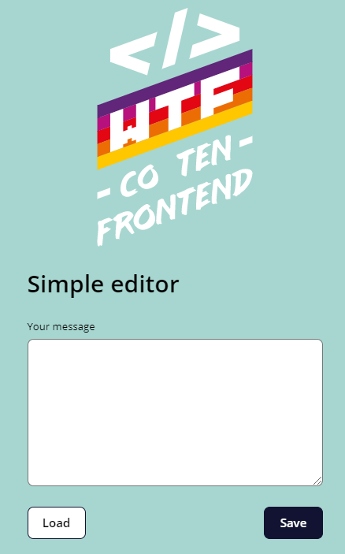
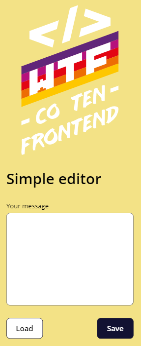

# Simple editor 📝

Simply editor uses CSS animations and local storage.

Please visit website: [Simply editor](https://przemekjuzwiszin.github.io/simple-editor)

## Steps that I took to create this editor: 🏆
1. I have set up a new git repository.
2. I have uploaded the [wtf-gulp-starterkit](https://github.com/maciejkorsan/wtf-gulp-starter).
3. I use a git branch to make changes.
4. I created a simple graphic design and transferred it to HTML and CSS code.
5. I use the querySelector function to get the textarea and buttons element.
6. To buttons I added EventListener method.
    - button save: saves the content in local storage.
    - button load: loads content from local storage.

### Tools and technologies I've used: 🔧 
- Git
- Trello
- Figma
- Visual Studio Code
- Gulp starterkit
    - local server with auto refresh
    - SCSS and sourcemap support
- CSS: flex
- HTML
- JavaScript
- Markdown

### What I learned? 📦

- Adding --js modifier to add JavaScript code
- Cutting the design
- Using @media queries
- Using BEM for styling
- Building a responsive website
- Writing semantic HTML

### I learned something about: 🤔

- node.js & npm packages
- Responsive web applications
- CSS: animations
- JS: Local storage
- JS: DOM manipulations
  
#### How to run the page local?
Download the web starter kit.

[wtf-gulp-starter](https://github.com/maciejkorsan/wtf-gulp-starter)

To run the page locally, please follow the instructions below?

`npm install -g gulp-cli`

`npm install`

`gulp`

To publish your page using github pages use `npm run deploy`

#### If you are having problems installing npm packages and running gulp. Please follow the instructions below.

Install the last version.

`npm install node-sass@latest`

`npm rebuild node-sass`

`npm i`

`gulp`
